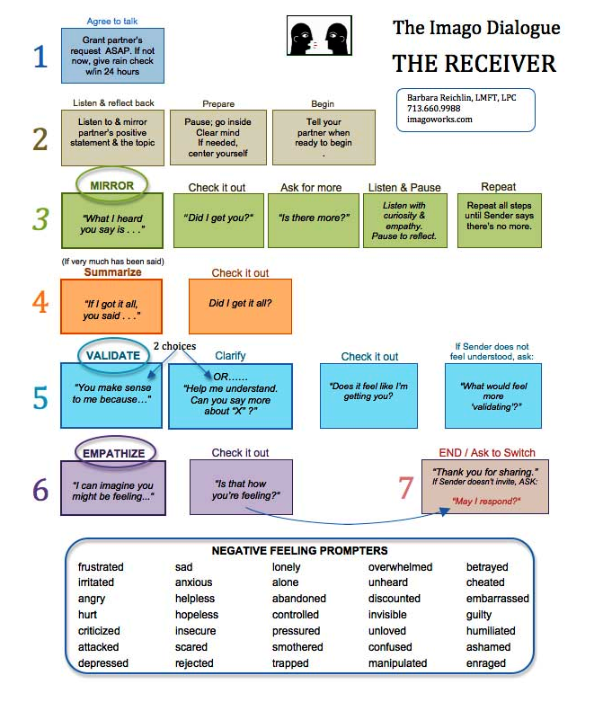

# Imago Dialogue

A structured communication practice that creates deep listening, mutual understanding, and emotional safety through three core steps: Mirror (reflect what you heard), Validate (acknowledge it makes sense), and Empathize (connect with feelings).

Imago Dialogue transforms reactive conversations into conscious connection, making it especially powerful for navigating conflict, processing emotions, and building trust in community settings.

<figure><figcaption></figcaption></figure>

## Overview

Imago Dialogue is a communication technique developed for couples therapy but highly effective in any relationship context - partnerships, community conflicts, team tensions, or healing conversations. It creates a structured container where one person (the Sender) shares while the other (the Receiver) listens deeply and reflects back without defending, explaining, or responding with their own perspective.

The practice slows down communication, creates safety through mirroring, and ensures both people feel heard before moving to problem-solving or response.

## Why Use Imago Dialogue

**Prevents Reactive Loops:** By requiring the Receiver to mirror before responding, it interrupts the reactive pattern of defending, explaining, or counter-attacking.

**Creates True Listening:** Most people listen to respond, not to understand. Mirroring forces genuine listening since you must accurately reflect what was said.

**Builds Psychological Safety:** Validation and empathy create safety even in difficult conversations, allowing deeper truth to emerge.

**Surfaces Hidden Feelings:** The structured empathy step helps name emotions that might be present but not explicitly stated.

**Equalizes Power:** Both people get equal time and attention. The structure prevents dominant personalities from overwhelming quieter voices.

**Enables Repair:** When relationships are strained, Imago creates a pathway back to connection through structured mutual understanding.

## The Seven Steps (for the Receiver)

### Step 1: Agree to Talk

**Grant your partner's request ASAP** - When someone asks for an Imago conversation, honor that request as soon as possible. If now doesn't work, give a rain check within 24 hours: "I can't right now, but let's talk at 7pm tonight."

**Why this matters:** Delayed conversations allow emotions to fester. Committing to a specific time shows the request is valued.

### Step 2: Listen & Reflect Back - Prepare

**Pause, go inside, clear your mind if needed, center yourself** - Take a few breaths. Set aside your own agenda, defensiveness, or the story you're telling yourself. Arrive present.

**Tell your partner when you're ready to begin** - "I'm ready to listen" signals you've settled and are fully available.

### Step 3: MIRROR

**Reflect back exactly what you heard** - "What I heard you say is..." Repeat their words as accurately as possible. Don't paraphrase, interpret, or add your own spin.

**Check it out** - "Did I get you?" This gives the Sender a chance to clarify or correct.

**Ask for more** - "Is there more about that?" Keep inviting until the Sender has fully expressed.

**Listen & Pause** - Pause for reflection between each mirroring cycle.

**Repeat all steps until Sender says there's no more** - Continue mirroring, checking, and asking for more until the Sender feels complete.

**If very much has been said: Summarize** - "If I got it all, you said..." This helps consolidate longer shares.

**Example:**
- Sender: "I feel frustrated when meetings start late because my time isn't being respected."
- Receiver: "What I heard you say is you feel frustrated when meetings start late because your time isn't being respected. Did I get you?"
- Sender: "Yes, and it makes me not want to come to meetings anymore."
- Receiver: "And it makes you not want to come to meetings anymore. Did I get that? Is there more?"

### Step 4: VALIDATE

**Two choices:**

**Option A - Affirm:** "You make sense to me because..." Explain why their perspective is logical, even if you see things differently. You're not agreeing, just acknowledging their view makes sense from their experience.

**Option B - Seek Clarification:** "Help me understand. Can you say more about 'X'?" If you can't yet see how it makes sense, ask for more information.

**Check it out** - "Does it feel like I'm getting you?"

**If Sender doesn't feel understood:** "What would feel more validating?" Give them a chance to guide you toward what would help them feel heard.

**Example:**
- Receiver: "You make sense to me because when we've committed to a time and then start late, it does communicate that your time isn't valued as much as the person who's late. Did that feel validating?"

### Step 5: EMPATHIZE

**Name the possible feelings** - "I can imagine you might be feeling..." Use the emotion words that seem present. Reference the Negative Feeling Prompters if helpful: frustrated, sad, lonely, overwhelmed, betrayed, hurt, angry, anxious, abandoned, etc.

**Check it out** - "Is that how you're feeling?"

**Adjust based on feedback** - If you named the wrong emotion, ask "What are you feeling?" and mirror their answer.

**Example:**
- Receiver: "I can imagine you might be feeling frustrated and maybe even disrespected. Is that how you're feeling?"
- Sender: "Yes, frustrated for sure, and also just tired of bringing it up."
- Receiver: "Frustrated and tired of bringing it up. I get that."

### Step 6: EMPATHIZE - Check It Out

**Confirm emotional accuracy** - "Is that how you're feeling?" Make sure you've identified the right emotions.

### Step 7: END / Ask to Switch

**Thank them for sharing** - "Thank you for sharing this with me." Acknowledge the vulnerability it took.

**Check their state** - If the Sender doesn't smile or seem relieved, they may not feel fully heard yet. Ask: "May I respond?" or "Is there anything else?"

**Decide on next steps** - Sometimes the Sender just needed to be heard and the conversation is complete. Sometimes it's time to switch roles (they become Receiver, you become Sender). Sometimes you need a break before continuing.

## The Sender's Role

**Request the conversation** - "I'd like to have an Imago dialogue. Are you available now or can we schedule a time?"

**Share from your experience** - Use "I" statements. "I feel..." "I notice..." "I need..." Don't attack or blame.

**Allow mirroring** - Pause after each thought to let the Receiver mirror back. Correct them if they didn't get it right.

**Go deeper when asked** - When Receiver asks "Is there more?" check in with yourself. Is there more under the surface?

**Guide validation** - If validation doesn't land, help them understand what would feel validating.

**Name your feelings** - When they empathize, honestly say what you're feeling. Don't minimize or hide emotions.

## Negative Feeling Prompters

These emotion words can help identify what the Sender might be experiencing:

**Anger cluster:** frustrated, irritated, angry, hurt, criticized, attacked, depressed

**Sadness cluster:** sad, anxious, helpless, hopeless, insecure, scared, rejected

**Loneliness cluster:** lonely, alone, abandoned, controlled, pressured, smothered, trapped

**Overwhelm cluster:** overwhelmed, unheard, discounted, invisible, unloved, confused, manipulated

**Betrayal cluster:** betrayed, cheated, embarrassed, guilty, humiliated, ashamed, enraged

## When to Use Imago Dialogue

**Conflict resolution** - When tensions arise and you need to understand each other's perspectives before solving the problem.

**Processing emotions** - When someone is carrying difficult feelings and needs to be fully heard and validated.

**Repair after rupture** - When trust has been broken and you need to rebuild connection.

**Deepening intimacy** - For sharing vulnerabilities, fears, dreams, or needs in a safe container.

**Decision-making** - Before making decisions together, use Imago to ensure all perspectives are fully understood.

**Community tensions** - When interpersonal dynamics are affecting group cohesion.

## Tips for Success

**Set aside time** - Don't rush Imago. Allow at least 30-60 minutes for a full exchange where both people get to be Sender and Receiver.

**Minimize distractions** - Turn off phones, close laptops, create a quiet space.

**Stay in structure** - The formality might feel awkward at first, but the structure is what creates safety. Don't skip steps.

**Mirror exactly** - Resist the urge to paraphrase or "fix" their language. Mirror their actual words.

**Validate doesn't mean agree** - You can validate someone's perspective makes sense from their experience while still having a different view.

**Empathy requires guessing** - You might name the wrong emotion. That's okay - they'll correct you.

**Switch roles** - After the Sender feels complete, switch. The Receiver becomes Sender and gets equal time to share their perspective.

**Practice regularly** - Don't wait for crisis. Use Imago for positive sharing too: appreciations, dreams, desires.

## Application in Regenerative Communities

**Consent-based culture** - Imago creates the deep understanding needed for genuine consent rather than compliance.

**Healing from extractive systems** - Many people carry trauma from being unheard, invalidated, or dismissed. Imago provides corrective experience.

**Cross-cultural communication** - The structured mirroring helps bridge different communication styles and cultural norms.

**Power dynamics** - The equal turn-taking prevents those with more social power from dominating conversations.

**Distributed coordination** - Remote communities can practice Imago over video calls, creating connection despite physical distance.

**Conflict transformation** - Rather than avoiding or suppressing tensions, communities can work with them productively through Imago.

## Variations

**Group Imago** - One person shares while the whole group practices mirroring, validation, and empathy collectively.

**Written Imago** - Exchange letters following the Imago structure - useful for remote communities or when emotions are too intense for face-to-face.

**Appreciative Imago** - Use the structure to share gratitude and appreciation, building positive connection.

**Quick Imago** - In time-limited situations, focus just on mirroring and validation, saving full empathy for later.

## Related Patterns

- **Sharing Circle:** Another structured practice for deep listening, but in group format
- **Non-Violent Communication:** Complementary framework for expressing feelings and needs
- **Psychological Safety:** Imago builds the safety needed for vulnerable sharing
- **Monologs, Dialogs, Trialogs:** Imago is a specific form of Dialog (two-way exchange)
- **Navigate via Tension:** Use Imago to explore tensions in relationships and systems

## Resources

Imago Dialogue was developed by Dr. Harville Hendrix and Dr. Helen LaKelly Hunt. For more information, see imagoworks.com.

Practice is essential - Imago feels artificial at first but becomes natural with repetition. The structure creates the safety that allows true spontaneity and authenticity to emerge. In regenerative communities where deep trust and mutual understanding are foundational infrastructure, Imago Dialogue is a practical tool for building and maintaining that relational coherence.
