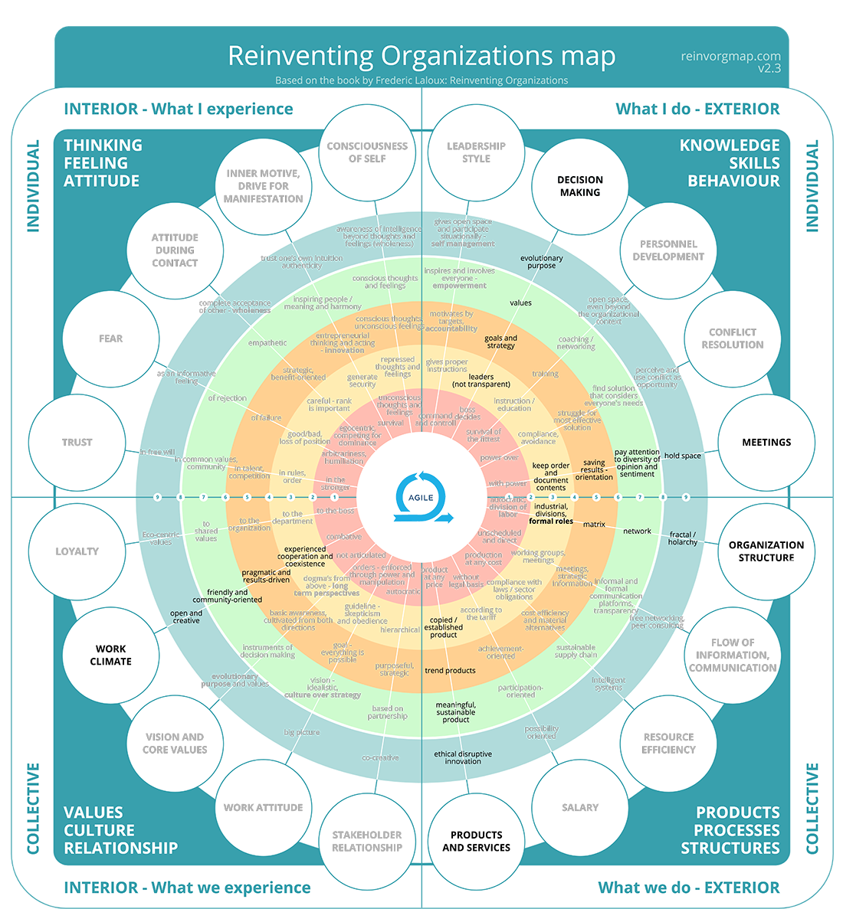

# Conscious Organizational Map

This map embeds concepts of spiral dynamics and integral theory, applying them to teams of people. It can be used to analyse the consciousness level of an organisation and to shows the strengths and areas with most growth potential

<figure><figcaption></figcaption></figure>

After you have formed a crew or started collaborating with others, you can give this map to your crew and ask them to draw a line between the  patterns you see at play.  Bring the different prospectives together and have a discussion on what could be improved and how.
